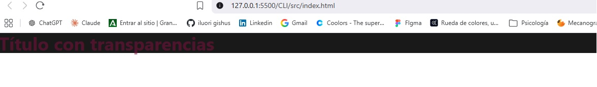
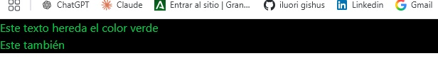
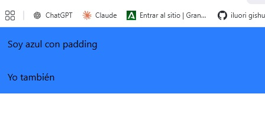
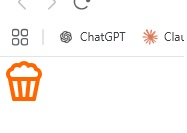
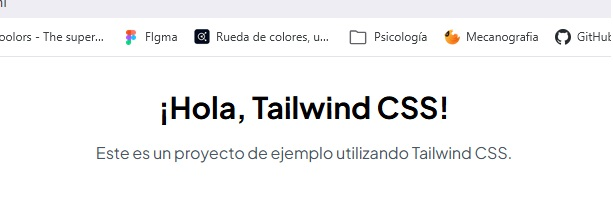

# 01. Instalación y Configuración de Tailwind CSS

## Metodología 1: Instalación mediante CDN
Esta instalación no es recomendada para producción pero sí para pruebas rápidas.

Para instalarlo se añade ```<script src="https://cdn.jsdelivr.net/npm/@tailwindcss/browser@4"></script>``` dentro de la etiqueta ```<head>``` del HTML.

## Metodología 2: Instalación mediante CLI
Es la forma profesional. Se utiliza la línea de comandos y NPM.
Debemos tener instalado previamente ```Node.js```.

### Pasos de instalación
1. Inicializar el proyecto:
   Abre la terminal en tu carpeta de trabajo y pon: ```npm init -y```
   Esto crea el archivo ```package.jason```.


2. Instalar Tailwind CSS
   En la terminal: ```npm install tailwindcss @tailwindcss/cli```
   Esto crea la carpeta ```node_modules``` y el archivo ```package-lock.sjon```.


3. Crear estructura de archivos:
   1- Crea una carpeta ```src```
   2- Dentro crea una carpeta ```css```
   3- Dentro de ```src/css```, crea un archivo ```tailwind.css```
   4- En ```src```, crea tu ```index.html```


4. Configurar Tailwind
   El archivo ```src/css/tailwind.css``` es importante y debe tener la importación de tailwind: ```@import "tailwindcss";```


5. Compilar el CSS
   Ejecutamos el comando CLI.
   ```npx @tailwindcss/cli -i ./src/css/tailwind.css -o -/src/css/estilos.css -watch```


6. Vincular en HTML
   En ```index.html```, enlaza el archivo generado ```estilos.css```: ```<link rel="stylesheet" href="css/estilos.css">```


# 02. Conceptos Base y Preflight
Preflight es un conjuntod e estilos bas que incluye Tailwind para resetear los estilos prederterminados de los navegadores. Asegura una consistencia de visionado en todos los navegadores desde el inicio y obtienes un control total ya que eliminamos el factor de que el navegador decida por ti.

## Cómo dar estilo
Usando ```Utility Classes```.
Como por ejemplo: ```<h1 clas="text-4x1 font-bold mb-4>Título Grand ey Negrita</h1>```

## Estilos Globales ```@layer base```
Se inserta en tu archivo CSS principal.
```
@import "tailwindcss";

@layer base {
  h1 {
    @apply text-4xl font-bold mb-4;
  }
}
```
Esto hará que, que todos los h1 tengan el mismo estilo.


# 03. Colores y Personalización

## Uso básico

Los colores se aplican combinando la propiedad con el nombre del color y su intensidad (50-950).
- Texto: ```text-color-intensidad```
- Fondo: ```bg-color-intensidad```
- Borde: ```border-color-intensidad```

## Opacidad transparencia

Barra inclinada ```/``` seguida del porcentaje de opacidad. Ejemplo: ```text-pink-600/50``` (50% de transparencia).

```<h1 class="bg-black/90 text-pink-900/50">Título con transparencias</h1>```



## Agrupación de Estilos

Si quieres aplicar el mismco color a más de un elemento, a veces puedes aguprarlos en un ```<div>``` padre.



**Hay que tener cuidado con la herencia.**

### Arbitrary Variants ```[&>*]```

Si realmente quieres forzar que todos los hijos tengan una propiedad no heredable (como padding o background), puedes usar ```[&>*]```:

```
<div class="[&>*]:bg-blue-500 [&>*]:p-4">
    <p>Soy azul con padding</p>
    <p>Yo también</p>
</div>
```



## Valores Personalizados (Arbitrary Values)

Si un color no está en la paleta de Tailwind solo debes usar corchetes ```[]```

```<h1 class="bg-[#2E86AB] text-white">Título con color personalizado directo</h1>```


## Ejemplo Práctico: Iconos SVG

Vamos a usar un icono SVG externo (ej. de boxicons.com) y controlarlo con Tailwind.

1. Copiamos el SVG.
2. **Importante**: Eliminamos los estilos en línea que traiga (`width`, `height`, `fill`) para que Tailwind pueda controlarlos.
3. Añadimos nuestras clases: `w-`, `h-`, `fill-`.

```
<svg  xmlns="http://www.w3.org/2000/svg" viewBox="0 0 24 24"  class="w-12 h-12 fill-[#ff6600]">
   <!--Boxicons v3.0.8 https://boxicons.com | License  https://docs.boxicons.com/free-->
   <path d="M18.76 5.24A3.5 3.5 0 0 0 15.5 3c-.31 0-.63.04-.93.13a3.487 3.487 0 0 0-5.14 0C9.12 3.04 8.81 3 8.5 3c-1.47 0-2.75.91-3.26 2.24a3.498 3.498 0 0 0-1.22 5.73c0 .08-.02.15 0 .22l2 10c.09.47.5.8.98.8h10c.48 0 .89-.34.98-.8l2-10c.02-.08 0-.15 0-.22.63-.63 1.02-1.51 1.02-2.47 0-1.47-.91-2.75-2.24-3.26M6.23 7.03a.99.99 0 0 0 .8-.8c.18-.97 1.33-1.55 2.24-1 .24.14.52.18.79.11.27-.08.49-.26.62-.5a1.486 1.486 0 0 1 2.66 0c.13.25.35.43.62.5.27.08.55.04.79-.11.91-.54 2.06.03 2.24 1 .07.41.39.73.8.8a1.498 1.498 0 0 1-.27 2.97H6.5a1.498 1.498 0 0 1-.27-2.97M13.4 12l-.8 8h-1.19l-.8-8zm-7.18 0H8.6l.8 8H7.82zm9.96 8H14.6l.8-8h2.38z"></path>
   </svg>
```




# 04. Tipografía

## Fuente Predeterminada

Por defecto, Tailwind aplica la fuente Sans-Serif `(ui-sans-serif)`.

Si aplicas una clase de fuente al body, como font-family es una propiedad **heredable**, se aplicará a toda la página.

## Fuentes Personalizadas (Google Fonts)

Para usar una fuente que no sea estándar, lo ideal es usar **Google Fonts** y valores arbitrarios.

### Pasos:
1. Ve a [Google Fonts](https://fonts.google.com/).
2. Busca una fuente.
3. Selecciona los estilos que quieras.
4. Copia los `<link>` que te proporciona y pégalos en el `<head>` de tu HTML.

```
<head>
  <!-- ... otros meta tags ... -->
  <link rel="preconnect" href="https://fonts.googleapis.com">
  <link rel="preconnect" href="https://fonts.gstatic.com" crossorigin>
  <link href="https://fonts.googleapis.com/css2?family=Plus+Jakarta+Sans:ital,wght@0,200..800;1,200..800&display=swap" rel="stylesheet">
</head>
```

### Usar la fuente personalizada

Ahora usa la sintaxis de **corchetes** `font-[Nombre_Fuente]`.

```
<body class="font-[Plus_Jakarta_Sans]">
   <h1 class="text-3xl font-bold text-center mt-8">¡Hola, Tailwind CSS!</h1>
   <p class="text-center mt-4 text-gray-600">Este es un proyecto de ejemplo utilizando Tailwind CSS.</p>
</body>
```


## Tamaños (`font-size`)

Tailwind usa una escala T-shirt (XS, SM, base, LG, XL...).

- `text-xs`: Extra pequeño
- ...
- `text-base`: Tamaño base (normalmente 16px)
- ...
- `text-5xl`: 5 veces el tamaño XL

También puedes usar valores arbitrarios si necesitas un tamaño exacto: `<p class="text-[40px]">Texto de 40 píxeles exactos</p>`


## Peso (`font-weight`)

Dependiendo de la fuente (especialmente en Google Fonts), tendrás disponibles diferentes pesos.

| Clase Tailwind | Peso CSS |
| :--- | :--- |
| `font-thin` | 100 |
| `font-light` | 300 |
| `font-normal` | 400 |
| `font-medium` | 500 |
| `font-bold` | 700 |
| `font-black` | 900 |

### Ejemplo Combinado

`<h1 class="text-5xl font-medium italic text-start">Textos en Tailwind</h1>`

En este ejemplo combinamos tamaño grande de texto, peso  medio, estilo cursiva y alineación a la izquierda (inicio).


# 05. Box Model y Dimensiones

## Anchura (`width`)

Tailwind ofrece dos formas principales de definir la anchura con la clase `w-`:

### 1. Sistema Numérico
Tailwind usa una escala donde 1 unidad = 0.25rem (4px).
Por tanto, multiplicas el número por 4 para saber los píxeles.

- `w-1` = 4px
- `w-4` = 16px
- `w-full` = 100%

### 2. Fracciones (Porcentajes)
Muy útil para layouts fluidos, se usan fracciones.

- `w-1/2` = 50%
- `w-1/3` = 33.333%
- `w-full` = 100%

(También puedes usar valores arbitrarios para anchos específicos)

### Ejemplo Práctico

```
<div class="text-center w-1/2 bg-amber-300">
   <h1 class="text-5xl">Mitad de ancho</h1>
</div>
```

(img9)

## Imágenes Responsivas

Para asegurar que una imagen nunca desborde su contenedor, es una buena práctica darle `w-full`.

```html
<div class="w-1/2 bg-amber-300">
    <!-- La imagen ocupará el 100% del ancho de SU PADRE (el 50% de la pantalla) -->
    
</div>
```

## Altura (`height`) y el Problema del 100%

La propiedad `h-` funciona de forma muy similar a `w-`.

- `h-full` = 100%
- `h-screen` = 100vh (altura de la ventana visible)
- `h-4/5` = 80%

Para que una altura en porcentaje (`h-4/5`, `h-full`) funcione, **el padre del elemento debe tener una altura definida explícitamente**. Si el `body` no tiene altura, sus hijos no pueden calcular el "80% de nada".

La solución es: Aplica `h-screen` al elemento padre principal (normalmente el `<body>` o un contenedor *wrapper*) para que ocupe toda la altura de la ventana.

```html
<!-- Correcto -->
<body class="font-[Plus_Jakarta_Sans] h-screen">
    
    <div class="text-center w-md h-4/5 bg-amber-300">
        <!-- Ahora sí ocupará el 80% de la altura de la pantalla (que hereda del body) -->
        ... contenido ...
    </div>

</body>
```

## Padding (Relleno Interno)

El padding añade espacio dentro del elemento, entre el contenido y el borde.

### Sintaxis Básica

- `p-10`: Padding de 40px (10 × 4px) en todos los lados.
- `px-10`: Padding horizontal (izquierda y derecha).
- `py-20`: Padding vertical (arriba y abajo).

### Padding Individual por Lado

- `pt-4`: Padding top (arriba)
- `pb-4`: Padding bottom (abajo)
- `pl-4`: Padding left (izquierda)
- `pr-4`: Padding right (derecha)

```html
<div class="bg-blue-500 p-10">
    <p class="bg-white">Contenido con padding de 40px alrededor</p>
</div>
```

(img10)

## Margin (Margen Externo)

El margin funciona exactamente igual que el padding, pero añade espacio fuera del elemento.

### Sintaxis

- `m-10`: Margin de 40px en todos los lados.
- `mx-10`: Margin horizontal.
- `my-20`: Margin vertical.
- `mt-4`, `mb-4`, `ml-4`, `mr-4`: Márgenes individuales.

### Centrar Horizontalmente

Usa `mx-auto` para centrar un elemento horizontalmente en su contenedor.

```
<div class="w-1/2 mx-auto bg-amber-300">
    <!-- Este div estará centrado horizontalmente -->
</div>
```

(img11)

### Márgenes Negativos

Se usa el signo negativo antes de la clase. Los márgenes negativos se usan cuando queremos que elementos se solapen.

```
<div class="-mb-6">
    <!-- Margen bottom negativo de -24px -->
</div>
```

## Bordes

### Grosor del Borde

- `border`: Borde de 1px en todos los lados.
- `border-2`, `border-4`, `border-8`: Bordes más gruesos.
- `border-x-10`: Borde horizontal (izquierda y derecha).
- `border-y-10`: Borde vertical (arriba y abajo).
- `border-t`, `border-b`, `border-l`, `border-r`: Bordes individuales.

  ### Color del Borde

```
<nav class="border-x-10 border-amber-400">
    <!-- Borde horizontal de 40px color ámbar -->
</nav>
```

(img12)

### Estilo del Borde

El estilo del borde se aplica a todos los lados, no se puede aplicar solo a un lado específico.

Tailwind ofrece diferentes estilos de borde (similar a `border-style` en CSS): 

- `border-solid` (por defecto)
- `border-dashed`
- `border-dotted`
- `border-double`
- `border-none`

```
<div class="border-4 border-blue-500 border-dashed">
    Borde azul discontinuo
</div>
```

(img13)

## Espaciado entre Elementos Hijos: `space-`

Si tienes varios elementos dentro de un contenedor y quieres separarlos, en lugar de añadir `margin` a cada uno individualmente, usa las clases `space-`. **Se aplica al padre**, no a los hijos.

- `space-x-4`: Añade margen horizontal entre hijos.
- `space-y-4`: Añade margen vertical entre hijos.

```
<nav class="space-y-4">
    <a href="#" class="bg-slate-800 px-8 py-4 block">Inicio</a>
    <a href="#" class="bg-slate-800 px-8 py-4 block">Acerca de</a>
    <a href="#" class="bg-slate-800 px-8 py-4 block">Contacto</a>
</nav>
```

(img14)

## Bordes entre Elementos Hijos: `divide-`

Similar a `space-`, pero en lugar de márgenes, añade bordes entre los elementos hijos. Debes especificar también el grosor, color y estilo.

- `divide-x`: Bordes verticales entre hijos.
- `divide-y`: Bordes horizontales entre hijos.

```
<nav class="flex divide-x-10 divide-lime-500 divide-dotted">
    <a href="#" class="px-8 py-4">Inicio</a>
    <a href="#" class="px-8 py-4">Acerca de</a>
    <a href="#" class="px-8 py-4">Contacto</a>
</nav>
```

(img15)

## Problema con `<a>` y Padding Vertical

Los elementos `<a>` son **inline** por defecto. El padding vertical (`py-`) no se aplica correctamente a elementos inline. La solución es camiar el display a `inline-block` o `block`.

```html
<!-- No funciona correctamente -->
<a href="#" class="px-8 py-4">Enlace</a>

<!-- Correcto -->
<a href="#" class="px-8 py-4 inline-block">Enlace</a>
<!-- o -->
<a href="#" class="px-8 py-4 block">Enlace</a>
```

## Ejemplo Completo: Card con Tailwind

```html
<div class="w-md mx-auto my-20 border-2 border-gray-500/50 py-7 px-5 rounded-2xl space-y-8">
  
  <h3 class="text-3xl font-bold my-6">¡Título Card!</h3>
  <p>Lorem ipsum dolor sit amet consectetur adipisicing elit. Aut fuga temporibus consectetur libero impedit a
    provident sed exercitationem, praesentium quam ea accusamus voluptatem unde? Est rem quod dignissimos sint
    tempora.
  </p>
  <a href="#" class="block bg-blue-600 text-white text-center py-4 rounded-full">Leer más</a>
</div>
```

(img16)
